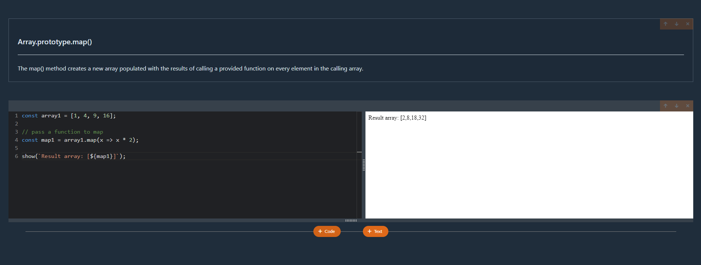

# Javascript notebook
> React/typescript project with in-browser code bundling and execution (a simplified version of sites like codePen but only for javascript and React)

> You can test it out by running 
```sh
npx jsnote serve
```



